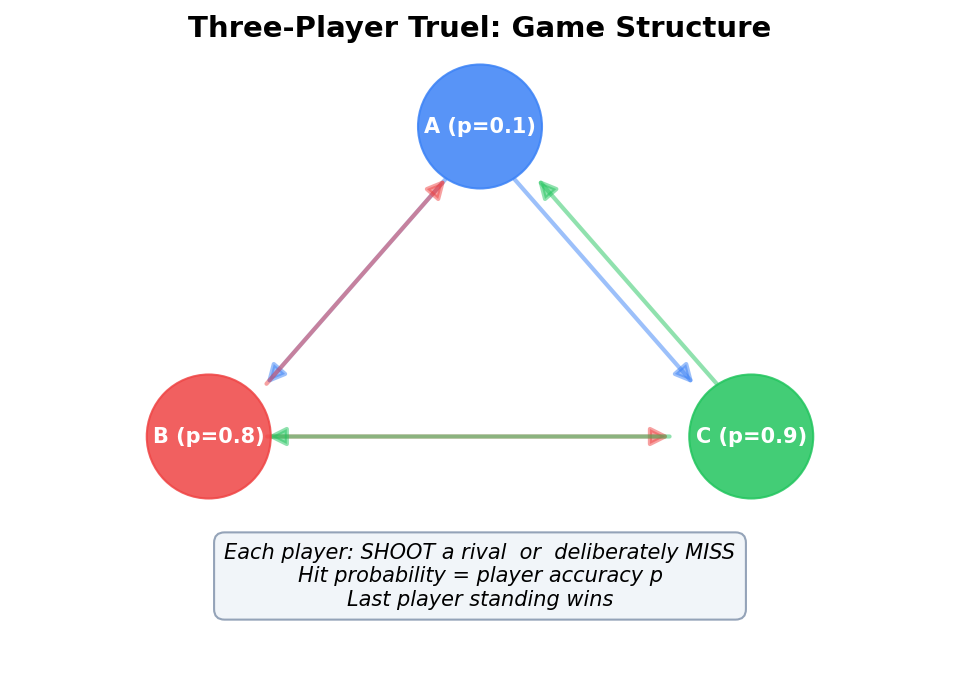
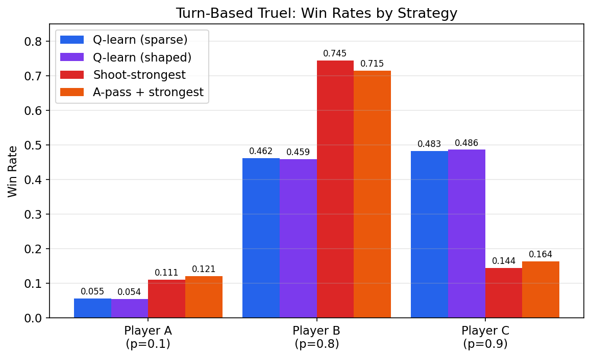
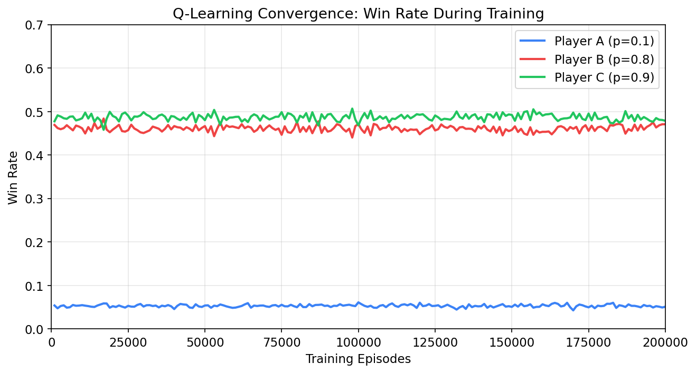
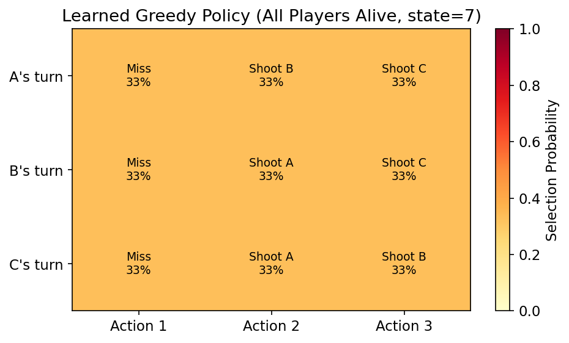

# Truel Q-Learning & Nash-Q: Reinforcement Learning for Three-Player Duels

A collection of Python scripts exploring **multi-agent reinforcement learning** applied to the classical [truel](https://en.wikipedia.org/wiki/Truel) (three-player duel) problem. The code accompanies an article investigating whether RL agents can rediscover known game-theoretic equilibria and the "weakest-survives" paradox.

## Game Structure

Three players (A, B, C) with different shooting accuracies take turns (or fire simultaneously). Each turn a player may **shoot** a rival or deliberately **miss**. A hit eliminates the target. The last player standing wins.



| Player | Accuracy |
|--------|----------|
| A      | 10%      |
| B      | 80%      |
| C      | 90%      |

## Scripts

| # | File | Method | Description |
|---|------|--------|-------------|
| 1 | `01_truel_turn_based_qlearning.py` | Independent Q-learning | Sparse terminal reward (+1 win / −1 lose). Minimal baseline. |
| 2 | `02_truel_turn_based_qlearning_shaped.py` | Q-learning + reward shaping | Adds per-step cost (−0.002) to encourage faster convergence. Includes two heuristic baselines. |
| 3 | `03_simultaneous_truel_nashq_approx_fast.py` | Nash-Q (approximate) | Simultaneous-fire variant. Uses logit best-response fixed-point iteration to approximate Nash equilibria at each state. |

## Results

### Win Rates by Strategy

The chart below compares the win rates discovered by RL agents against two hand-coded heuristic baselines:



**Key finding — the weakest-survives paradox:**
- Under Q-learning self-play, Player A (accuracy 10%) wins only ~5.5% of games
- Players B and C split the remaining wins roughly evenly (~46–48% each)
- By contrast, the naive "shoot-strongest" heuristic gives B a dominant 74.5% win rate — RL agents learn to avoid this exploitable strategy

| Strategy | A win% | B win% | C win% |
|----------|--------|--------|--------|
| Q-learn (sparse) | 5.53 | 46.15 | 48.32 |
| Q-learn (shaped) | 5.44 | 45.94 | 48.62 |
| Shoot-strongest baseline | 11.08 | 74.50 | 14.41 |
| A-pass + shoot-strongest | 12.10 | 71.54 | 16.36 |

### Training Convergence

Win rates stabilize after ~80k episodes as epsilon decays below 0.1:



### Learned Policy (All Players Alive)

The heatmap shows the greedy policy each agent selects when all three players are alive:



**Interpretation:**
- **A (weakest)** learns to miss intentionally — shooting either strong player risks leaving the other strong player with fewer rivals
- **B and C** target each other — eliminating the strongest remaining threat is optimal for both

This matches the classical game-theory result: the weakest player's best strategy is to deliberately miss while the two stronger players eliminate each other.

### Nash-Q Convergence (Simultaneous Fire)

The simultaneous-fire Nash-Q solver converges to low summed regret (~0.08–0.14) within 12k episodes, confirming the approximate equilibrium is reasonable:

```
ep=3000  eps=0.122  regret(ABC)=0.160
ep=6000  eps=0.050  regret(ABC)=0.079
ep=9000  eps=0.050  regret(ABC)=0.128
ep=12000 eps=0.050  regret(ABC)=0.143
```

## Usage

```bash
# Run each script independently
python 01_truel_turn_based_qlearning.py
python 02_truel_turn_based_qlearning_shaped.py
python 03_simultaneous_truel_nashq_approx_fast.py

# Regenerate figures
python generate_figures.py
```

### Requirements

- Python 3.10+
- NumPy
- Matplotlib (for figure generation only)

## References

- Kilgour, D.M. & Brams, S.J. (1997). *The Truel*. Mathematics Magazine.
- Hu, J. & Wellman, M.P. (2003). *Nash Q-Learning for General-Sum Stochastic Games*. JMLR.
